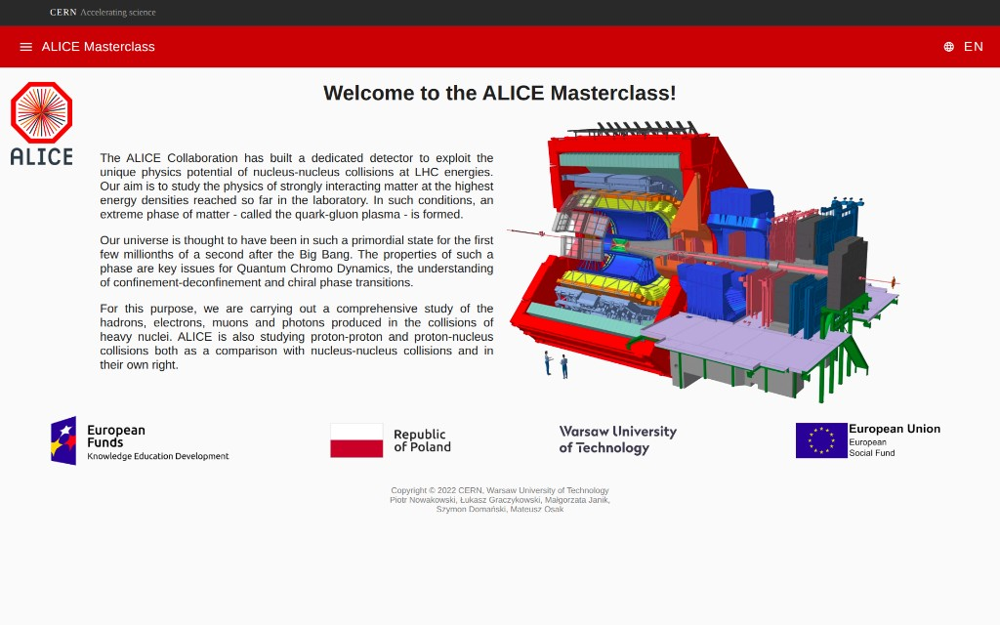
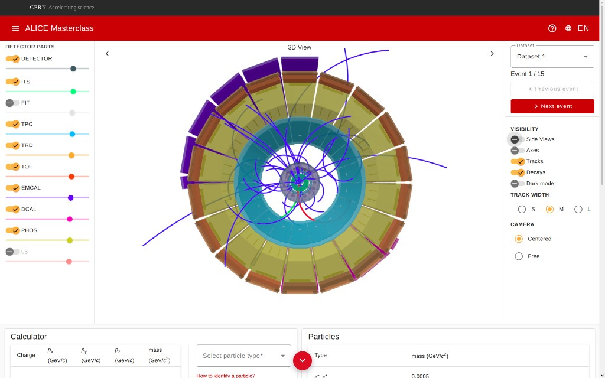
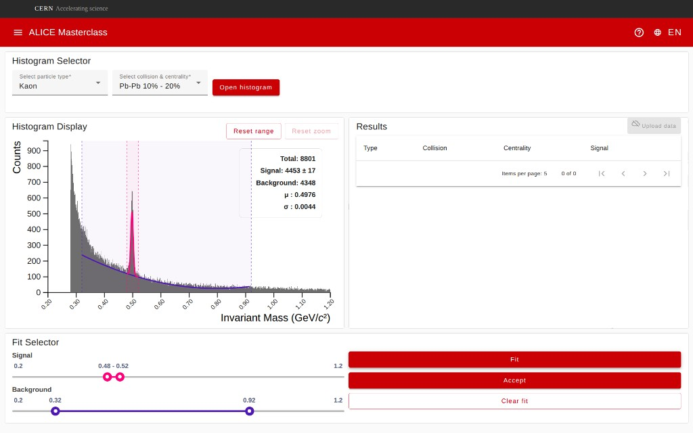
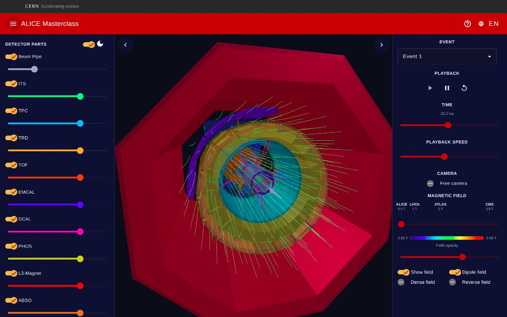
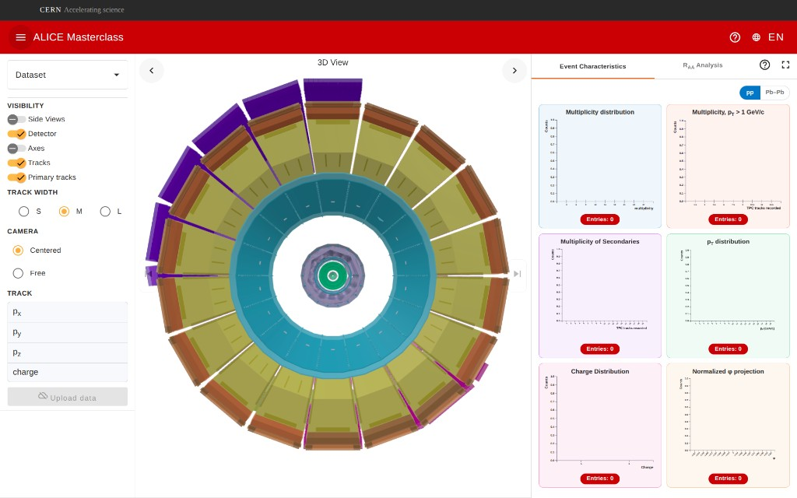
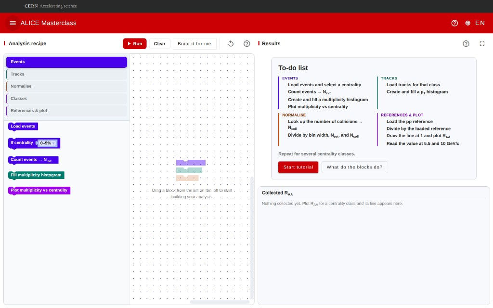
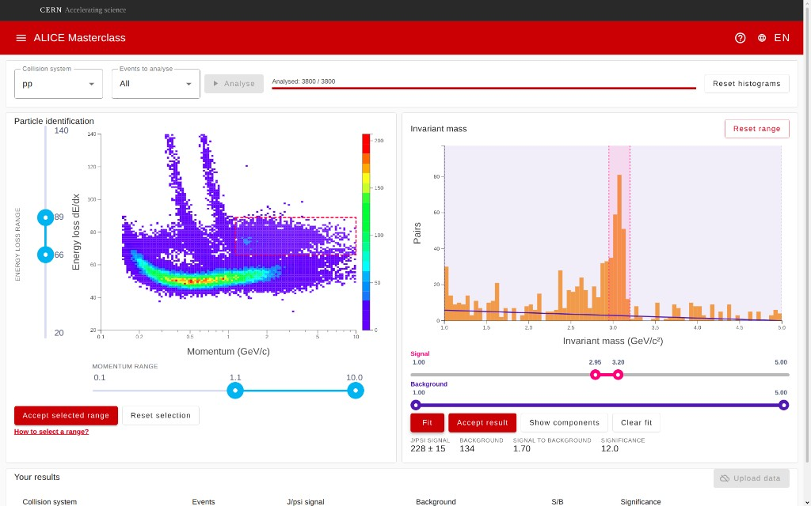

# ALICE MasterClass

Interactive educational platform for the [ALICE](https://alice-collaboration.web.cern.ch/) experiment at CERN — students explore heavy-ion collisions, reconstruct strange particles, measure nuclear modification, and follow charged tracks in a 3D detector.

**Try the live student app (dev — public):**  
**https://alice-web-masterclass-dev.app.cern.ch**

<p align="center">
  
</p>

---

## What this is

A full-stack workshop stack used in ALICE MasterClasses:

| Piece | Stack | Role |
| --- | --- | --- |
| Student app | Angular + Three.js | Exercises, 3D event display, histograms, guided tours |
| Teacher panel | Angular | Session management, CERN SSO, results overview |
| API | Django + DRF | Auth, sessions, result upload |

Built and extended at **CERN** / **Warsaw University of Technology** (authors include Piotr Nowakowski, Łukasz Graczykowski, Małgorzata Janik, **Szymon Domański**, **Mateusz Osak**).

---

## Exercises (module by module)

### 1. Home — choose your MasterClass

Landing page with ALICE branding, short intro to quark–gluon plasma research, and entry points into each exercise (plus language switcher and help). Screenshot above.

---

### 2. Strangeness — Visual Analysis

Students inspect real collision events in a **3D ALICE detector**, toggle subdetectors (ITS, TPC, TOF, calorimeters, L3, …), browse events, and identify decay candidates with a momentum/mass calculator and particle list.

<p align="center">
  
</p>

Highlights: interactive EventDisplay (Three.js), side views, detector part visibility, track styling, dark mode, optional guided detector assembly and driver.js tutorials.

---

### 3. Strangeness — Large Scale Analysis

Students open invariant-mass histograms for chosen particle type / collision / centrality, fit **signal + background** with range sliders, read out yield and peak parameters, and collect rows in a results table (upload when a workshop session is active).

<p align="center">
  
</p>

---

### 4. Particle Propagation

Animated propagation of charged particles through the detector volume with a configurable **magnetic field** (ALICE / LHCb / ATLAS / CMS presets), playback scrubbing, and detector-layer toggles — useful to build intuition for track curvature vs \(p_T\) and \(B\).

<p align="center">
  
</p>

Physics note: RK4 integration and ALICE Chebyshev field map (ported research code; see [`ci/docs/particle-propagation.md`](ci/docs/particle-propagation.md)).

---

### 5. Nuclear modification — Event Exploration (R<sub>AA</sub>)

3D event browsing for pp / Pb–Pb samples with track parameter readouts and live **event-characteristic histograms** (multiplicity, \(p_T\), charge, \(\phi\), …) as students step through collisions.

<p align="center">
  
</p>

---

### 6. Nuclear modification — Spectrum Analysis (R<sub>AA</sub>)

Block-based “analysis recipe” (Events → Tracks → Normalise → References & plot). Students assemble the R<sub>AA</sub> pipeline step by step, run it, and collect R<sub>AA</sub> curves per centrality — with a built-in to-do list and tutorial.

<p align="center">
  
</p>

---

### 7. J/ψ analysis

PID selection on a **dE/dx vs momentum** map, then invariant-mass fitting of unlike-sign pairs to extract the J/ψ peak (signal, background, S/B, significance) for pp or Pb–Pb samples.

<p align="center">
  
</p>

---

## Architecture (short)

```
Browser (student / teacher SPA)
        │
        ▼
 Django REST API  ──►  PostgreSQL (workshop) / sessionStorage (demo)
        │
 OpenShift (CERN OKD)  ·  GitLab CI tag deploy (v*-dev / v*-demo)
```

- Shared **EventDisplay** Three.js component for strangeness & nuclear-modification visuals ([`ci/docs/event-display.md`](ci/docs/event-display.md)).
- Workshop mode talks to Django; **demo** build is offline (no login / no upload).
- i18n: EN / PL / DE / FR / ES via `@ngx-translate`.

---

## Repository layout

| Path | Role |
| --- | --- |
| `alice-masterclass-js/` | Student Angular app |
| `alice-masterclass-teacher/` | Teacher Angular app |
| `alice-masterclass-django/` | REST API |
| `ci/docs/` | Architecture, deploy, E2E, changelogs |
| `openshift/` | OKD manifests (dev / demo) |

**Run locally** (developer README): [`ci/docs/local-development.md`](ci/docs/local-development.md)  
**Docs index:** [`ci/docs/README.md`](ci/docs/README.md)

---

## License

MIT — see [`LICENSE.md`](LICENSE.md) (copyright holders include Szymon Domanski, Mateusz Osak, Piotr Nowakowski, Maxime GRIS).  
Particle-propagation field/integrator code retains **GPL-3.0** attribution from the upstream research ports (documented in-app / in `ci/docs`).

---

## Links

| | |
| --- | --- |
| Student **dev** | https://alice-web-masterclass-dev.app.cern.ch |
| Student **demo** (public) | https://alice-web-masterclass-demo.app.cern.ch |
| Teacher **dev** | https://teacher-alice-web-masterclass-dev.app.cern.ch |
| Upstream / CERN GitLab | `alice-masterclass-dev-group/ALICE-MasterClass-Dev` |
